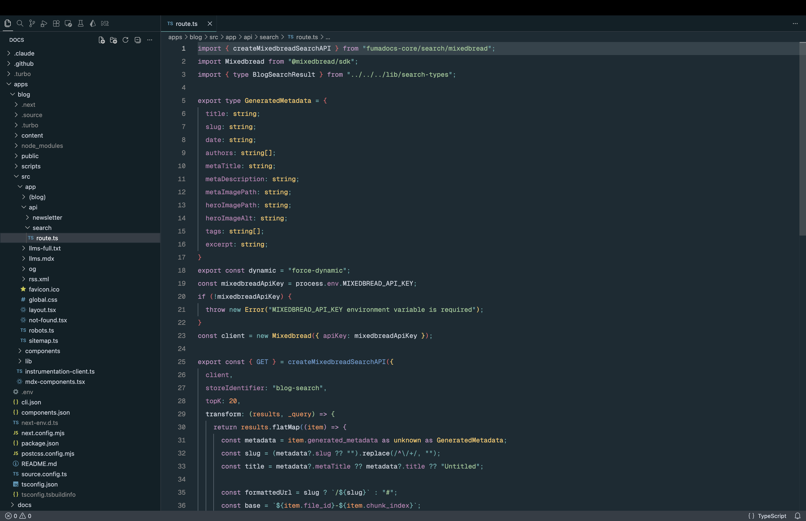

# Oceanic Next for VS Code

Oceanic Next is a dark, contrast-balanced theme for VS Code inspired by the original [Oceanic Next color scheme](https://github.com/voronianski/oceanic-next-color-scheme).

## Preview

## Why Oceanic Next?

- Carefully tuned colors for long coding sessions
- Clear syntax highlighting across common languages
- Dark UI palette that keeps focus on your code

## Install

1. Open **Extensions** in VS Code.
2. Search for `Oceanic Next`.
3. Click **Install**.

## Activate

1. Open the Command Palette with `Cmd/Ctrl + Shift + P`.
2. Run `Preferences: Color Theme`.
3. Select `Oceanic Next`.
